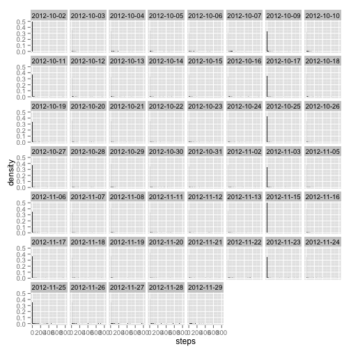
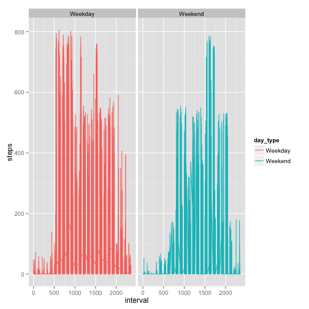

This is an R Markdown document that satisfies the requirements of the first Peer Assessment for Coursera's "Reproducible Research" class within the Data Science Specialization. The purpose is to deomonstrate facility with R markdown through the detailed documentation of the steps in a selected series of data analysis.

##Loading and preprocessing the data

The first thing we'd like to do is download, unzip, and read the data into memory.


```r
#loading dplyr, which is far superior for editing data than the base subsetting options. 
#would definitely suggest taking the Swirl class on this (which I happened to learn expanded to include dplyr after I took R Programming)
require(dplyr)
require(lubridate)

#download the file
dataUrl<-"https://d396qusza40orc.cloudfront.net/repdata%2Fdata%2Factivity.zip"
download.file(url=dataUrl,"Activity_Monitoring_Data.zip",method="curl")

#unzip the file
unzip("Activity_Monitoring_Data.zip")

#load the csv
raw<-read.csv("activity.csv")

#Convert to "table frame." This is available in dplyr and lets you perform dplyr functions.
#printing a data frame also will provide a super convenient summary instead of displaying everything.
raw<-tbl_df(raw)

#Convert date into date format from factor. Using Lubridate's simple function
raw[,2]<-ymd(raw[,2])

#Eliminate any NA values
base<-raw[complete.cases(raw),]

#Print the summary of the result.
base
```

```
## Source: local data frame [15,264 x 3]
## 
##     steps       date interval
## 289     0 2012-10-02        0
## 290     0 2012-10-02        5
## 291     0 2012-10-02       10
## 292     0 2012-10-02       15
## 293     0 2012-10-02       20
## 294     0 2012-10-02       25
## 295     0 2012-10-02       30
## 296     0 2012-10-02       35
## 297     0 2012-10-02       40
## 298     0 2012-10-02       45
## ..    ...        ...      ...
```

##What is mean total number of steps taken per day?

Having already taken care of removing the missing values above, we move on to creating a histogram of total number of steps per day. Using this as a chance to practice using ggplot2.


```r
require(ggplot2)
#p<-qplot(base$steps,binwidth=2) + coord_cartesian(ylim = c(0, 150)) + geom_hline(aes(yintercept=mean(base$steps),color="orange"))+annotate("text", x=700, y=mean(base$steps)+5, label="Avg Steps Per Day")

#Make a histogram of the total number of steps taken each day
#basically following the instructions best I can, throwing up a histogram, but split into separate plots by day. Clearly doesn't work out so well. Would love to see how other people tackled this.
ggplot(base, aes(steps, ..density..)) + geom_histogram(binwidth = 2) + facet_wrap(~ date)
```

 

```r
#By necessity, I am limiting the range for the y values, as 0 steps amounts to 11,014 measurements, thus taking up a huge portion of the chart.

av<-base %>% group_by(date) %>% summarize(mean(steps))
names(av)[2]<-"mean_steps"
print("The mean steps by day is below:")
```

```
## [1] "The mean steps by day is below:"
```

```r
av
```

```
## Source: local data frame [53 x 2]
## 
##          date mean_steps
## 1  2012-10-02     0.4375
## 2  2012-10-03    39.4167
## 3  2012-10-04    42.0694
## 4  2012-10-05    46.1597
## 5  2012-10-06    53.5417
## 6  2012-10-07    38.2465
## 7  2012-10-09    44.4826
## 8  2012-10-10    34.3750
## 9  2012-10-11    35.7778
## 10 2012-10-12    60.3542
## 11 2012-10-13    43.1458
## 12 2012-10-14    52.4236
## 13 2012-10-15    35.2049
## 14 2012-10-16    52.3750
## 15 2012-10-17    46.7083
## 16 2012-10-18    34.9167
## 17 2012-10-19    41.0729
## 18 2012-10-20    36.0938
## 19 2012-10-21    30.6285
## 20 2012-10-22    46.7361
## 21 2012-10-23    30.9653
## 22 2012-10-24    29.0104
## 23 2012-10-25     8.6528
## 24 2012-10-26    23.5347
## 25 2012-10-27    35.1354
## 26 2012-10-28    39.7847
## 27 2012-10-29    17.4236
## 28 2012-10-30    34.0938
## 29 2012-10-31    53.5208
## 30 2012-11-02    36.8056
## 31 2012-11-03    36.7049
## 32 2012-11-05    36.2465
## 33 2012-11-06    28.9375
## 34 2012-11-07    44.7326
## 35 2012-11-08    11.1771
## 36 2012-11-11    43.7778
## 37 2012-11-12    37.3785
## 38 2012-11-13    25.4722
## 39 2012-11-15     0.1424
## 40 2012-11-16    18.8924
## 41 2012-11-17    49.7882
## 42 2012-11-18    52.4653
## 43 2012-11-19    30.6979
## 44 2012-11-20    15.5278
## 45 2012-11-21    44.3993
## 46 2012-11-22    70.9271
## 47 2012-11-23    73.5903
## 48 2012-11-24    50.2708
## 49 2012-11-25    41.0903
## 50 2012-11-26    38.7569
## 51 2012-11-27    47.3819
## 52 2012-11-28    35.3576
## 53 2012-11-29    24.4688
```

```r
md<-base %>% group_by(date) %>% summarize(median(steps))
names(md)[2]<-"median_steps"
print("The median steps by day is below:")
```

```
## [1] "The median steps by day is below:"
```

```r
md
```

```
## Source: local data frame [53 x 2]
## 
##          date median_steps
## 1  2012-10-02            0
## 2  2012-10-03            0
## 3  2012-10-04            0
## 4  2012-10-05            0
## 5  2012-10-06            0
## 6  2012-10-07            0
## 7  2012-10-09            0
## 8  2012-10-10            0
## 9  2012-10-11            0
## 10 2012-10-12            0
## 11 2012-10-13            0
## 12 2012-10-14            0
## 13 2012-10-15            0
## 14 2012-10-16            0
## 15 2012-10-17            0
## 16 2012-10-18            0
## 17 2012-10-19            0
## 18 2012-10-20            0
## 19 2012-10-21            0
## 20 2012-10-22            0
## 21 2012-10-23            0
## 22 2012-10-24            0
## 23 2012-10-25            0
## 24 2012-10-26            0
## 25 2012-10-27            0
## 26 2012-10-28            0
## 27 2012-10-29            0
## 28 2012-10-30            0
## 29 2012-10-31            0
## 30 2012-11-02            0
## 31 2012-11-03            0
## 32 2012-11-05            0
## 33 2012-11-06            0
## 34 2012-11-07            0
## 35 2012-11-08            0
## 36 2012-11-11            0
## 37 2012-11-12            0
## 38 2012-11-13            0
## 39 2012-11-15            0
## 40 2012-11-16            0
## 41 2012-11-17            0
## 42 2012-11-18            0
## 43 2012-11-19            0
## 44 2012-11-20            0
## 45 2012-11-21            0
## 46 2012-11-22            0
## 47 2012-11-23            0
## 48 2012-11-24            0
## 49 2012-11-25            0
## 50 2012-11-26            0
## 51 2012-11-27            0
## 52 2012-11-28            0
## 53 2012-11-29            0
```
##What is the average daily activity pattern?

I'll again rely on using the dplyr package to subset this data further. But for real. Get dplyr if you've not already. Hadley Wickman made it, yo.
These steps entail plotting mean steps vs. the interval, and finding the maximum number of steps.


```r
#set new variable equal to the mean of steps grouped by date mds for "mean date step"
mds<-base %>% group_by(interval) %>% summarize(mean(steps))
names(mds)[2]<-"mean_steps"

#plot mean steps vs interval
plot(mds$interval,mds$mean_steps,type="l",xlab="Interval",ylab="Mean Steps")
```

 

```r
#get the max value for mean steps
maxsteps<-max(mds$mean_steps)
print(paste("The maximum steps for an interval is at",maxsteps))
```

```
## [1] "The maximum steps for an interval is at 206.169811320755"
```
##Imputing missing values

The values do indeed differ once we've filled in the NA values. For one, we have mean steps for days for which we didn't have values (since I filled in based on interval and not date). This amounts to a total of 7 days for which there were not previously values. The means become higher, as the low modal value of zero brings down the average, and the medians remain the same, because zero is so common.

This was all accomplished by saving a data frame of the incomplete case indeces, as well as the intervals they corresponded to, and then creating a for loop that went to each complete case, and replaced it with the average for the corresponding interval.


```r
#Refer back to variable raw, which has all measurements, and subtracting its value from base measurements to get the number of missing values
nmv<-nrow(raw)-nrow(base)
print(paste("There are",nmv,"missing values"))
```

```
## [1] "There are 2304 missing values"
```

```r
incomplete<-which(!complete.cases(raw))
intv<-raw[incomplete,3]

rawold<-raw #was part of my process. just in case I needed to re-create the initial raw data frame.

#for loop goes through all incomplete cases, and turns NA values into the average for the interval in question
for(i in 1:length(incomplete))
{
        replacement<-raw %>% filter(interval==intv[i]) %>% summarize(mean(steps,na.rm=TRUE))
        
        raw[incomplete[i],1]<-replacement
}

ggplot(base, aes(steps, ..density..)) + geom_histogram(binwidth = 2) + facet_wrap(~ date)#same issues with plotting as before
```

 

```r
av2<-raw %>% group_by(date) %>% summarize(mean(steps))
names(av2)[2]<-"mean_steps"
print(paste("The mean steps by day is below:"))
```

```
## [1] "The mean steps by day is below:"
```

```r
av2
```

```
## Source: local data frame [61 x 2]
## 
##          date mean_steps
## 1  2012-10-01    37.3826
## 2  2012-10-02     0.4375
## 3  2012-10-03    39.4167
## 4  2012-10-04    42.0694
## 5  2012-10-05    46.1597
## 6  2012-10-06    53.5417
## 7  2012-10-07    38.2465
## 8  2012-10-08    37.3826
## 9  2012-10-09    44.4826
## 10 2012-10-10    34.3750
## 11 2012-10-11    35.7778
## 12 2012-10-12    60.3542
## 13 2012-10-13    43.1458
## 14 2012-10-14    52.4236
## 15 2012-10-15    35.2049
## 16 2012-10-16    52.3750
## 17 2012-10-17    46.7083
## 18 2012-10-18    34.9167
## 19 2012-10-19    41.0729
## 20 2012-10-20    36.0938
## 21 2012-10-21    30.6285
## 22 2012-10-22    46.7361
## 23 2012-10-23    30.9653
## 24 2012-10-24    29.0104
## 25 2012-10-25     8.6528
## 26 2012-10-26    23.5347
## 27 2012-10-27    35.1354
## 28 2012-10-28    39.7847
## 29 2012-10-29    17.4236
## 30 2012-10-30    34.0938
## 31 2012-10-31    53.5208
## 32 2012-11-01    37.3826
## 33 2012-11-02    36.8056
## 34 2012-11-03    36.7049
## 35 2012-11-04    37.3826
## 36 2012-11-05    36.2465
## 37 2012-11-06    28.9375
## 38 2012-11-07    44.7326
## 39 2012-11-08    11.1771
## 40 2012-11-09    37.3826
## 41 2012-11-10    37.3826
## 42 2012-11-11    43.7778
## 43 2012-11-12    37.3785
## 44 2012-11-13    25.4722
## 45 2012-11-14    37.3826
## 46 2012-11-15     0.1424
## 47 2012-11-16    18.8924
## 48 2012-11-17    49.7882
## 49 2012-11-18    52.4653
## 50 2012-11-19    30.6979
## 51 2012-11-20    15.5278
## 52 2012-11-21    44.3993
## 53 2012-11-22    70.9271
## 54 2012-11-23    73.5903
## 55 2012-11-24    50.2708
## 56 2012-11-25    41.0903
## 57 2012-11-26    38.7569
## 58 2012-11-27    47.3819
## 59 2012-11-28    35.3576
## 60 2012-11-29    24.4688
## 61 2012-11-30    37.3826
```

```r
md2<-raw %>% group_by(date) %>% summarize(median(steps))
names(md2)[2]<-"median_steps"
print("The median steps by day is below:")
```

```
## [1] "The median steps by day is below:"
```

```r
md2
```

```
## Source: local data frame [61 x 2]
## 
##          date median_steps
## 1  2012-10-01        34.11
## 2  2012-10-02         0.00
## 3  2012-10-03         0.00
## 4  2012-10-04         0.00
## 5  2012-10-05         0.00
## 6  2012-10-06         0.00
## 7  2012-10-07         0.00
## 8  2012-10-08        34.11
## 9  2012-10-09         0.00
## 10 2012-10-10         0.00
## 11 2012-10-11         0.00
## 12 2012-10-12         0.00
## 13 2012-10-13         0.00
## 14 2012-10-14         0.00
## 15 2012-10-15         0.00
## 16 2012-10-16         0.00
## 17 2012-10-17         0.00
## 18 2012-10-18         0.00
## 19 2012-10-19         0.00
## 20 2012-10-20         0.00
## 21 2012-10-21         0.00
## 22 2012-10-22         0.00
## 23 2012-10-23         0.00
## 24 2012-10-24         0.00
## 25 2012-10-25         0.00
## 26 2012-10-26         0.00
## 27 2012-10-27         0.00
## 28 2012-10-28         0.00
## 29 2012-10-29         0.00
## 30 2012-10-30         0.00
## 31 2012-10-31         0.00
## 32 2012-11-01        34.11
## 33 2012-11-02         0.00
## 34 2012-11-03         0.00
## 35 2012-11-04        34.11
## 36 2012-11-05         0.00
## 37 2012-11-06         0.00
## 38 2012-11-07         0.00
## 39 2012-11-08         0.00
## 40 2012-11-09        34.11
## 41 2012-11-10        34.11
## 42 2012-11-11         0.00
## 43 2012-11-12         0.00
## 44 2012-11-13         0.00
## 45 2012-11-14        34.11
## 46 2012-11-15         0.00
## 47 2012-11-16         0.00
## 48 2012-11-17         0.00
## 49 2012-11-18         0.00
## 50 2012-11-19         0.00
## 51 2012-11-20         0.00
## 52 2012-11-21         0.00
## 53 2012-11-22         0.00
## 54 2012-11-23         0.00
## 55 2012-11-24         0.00
## 56 2012-11-25         0.00
## 57 2012-11-26         0.00
## 58 2012-11-27         0.00
## 59 2012-11-28         0.00
## 60 2012-11-29         0.00
## 61 2012-11-30        34.11
```
##Are there differences in activity patterns between weekdays and weekends?

Here, turned day into day of the week, into a factor variable of two levels, weekday and weekend. Then, this was used to create a plot of steps/interval, split by weekday and weekend. Activity tends to be higher at the beginning of the day for the weekdays, and more skewed toward the end of the day on weekends.


```r
#give values for weekday and weekend
day_of_week<-weekdays(raw$date)
day_type<-day_of_week %in% c("Saturday","Sunday")
day_type[day_type==TRUE]<-"Weekend"
day_type[day_type==FALSE]<-"Weekday"
day_type<-as.factor(day_type)
raw<-cbind(raw,day_type)
raw<-tbl_df(raw) #making this a table frame again (not necessary at this point)

#plot weekday and weekend values for interval vs. steps
ggplot(raw,aes(x=interval,y=steps,color=day_type))+geom_line()+ facet_wrap(~ day_type)
```

 
